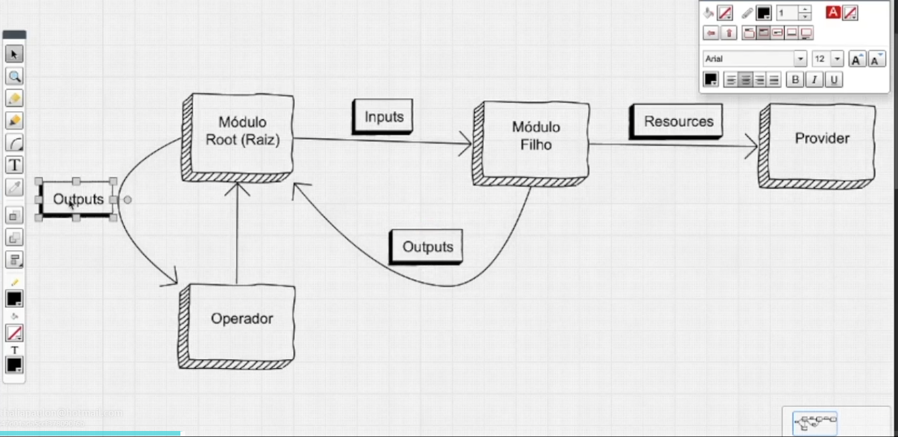

# linuxtips-terraform

TERRAFORM

terraform.io
Documentação oficial
https://developer.hashicorp.com/terraform/language/modules

Infraestrutura mutável
	A infraestrutura mutável, em oposição à infraestrutura imutável, é uma abordagem em que as alterações são feitas diretamente nos servidores existentes. Embora a infraestrutura mutável possa ser mais fácil 
	de gerenciar em pequenas escalas, ela pode ser difícil de gerenciar em ambientes maiores e mais complexos.
	
Infraestrutura imutavel
	A infraestrutura imutável é uma abordagem de gerenciamento de infraestrutura que envolve criar ambientes de infraestrutura como código (IaC), onde o código que define a infraestrutura é versionado, 
	testado e tratado como um aplicativo. A ideia por trás da infraestrutura imutável é que, em vez de alterar e atualizar diretamente os servidores existentes, a melhor prática é sempre criar novos servidores 
	a partir de um modelo ou template pré-configurado e descartar os servidores antigos após a implantação da nova versão.
	

Availability Zones AWS - Podemos pensar como Datacenters
Exemplo a região us-east-1 tem as AZ-a, AZ-b, AZ-c e etc

Arquivo HCL - Terraform

Elementos necessários 
	Argumentos
		Tudo que você configura dentro de um bloco 
		Ex:
		ami =
		region =
		version =
		key =

	Blocos
		Qualquer bloco de código que está dentro do seu arquivo (tudo que inicia e termina com {})
			RESOURCE o mais usado
				Resource NOME TIPO
				Ex:
				resource "NOME" "TIPO"
				resource "aws_instance" "example"

	Identificadores
		Qualquer nome que você dá para identificar qualquer coisa.
		Nunca começar um identificador com número
	
	Comentario
		Tudo que começar com
		#
		//
		Multilinhas
		/* (inicio)
		*/ (fim)
		
Criando um container para as aulas
docker run -it -v $PWD:/app -w /app --entrypoint "" hashicorp/terraform:light sh

HCL > BINÁRIO >> ESTADO (LOCAL OU REMOTO) e INFRA 
	comando INIT cria a pasta .terraform (tudo que o binário local precisa para executar as coisas, baixando plugin, etc, colocando tudo localmente)
	comando PLAN vai gerar o plano, um check, ver tudo o que tem para te dar um panorama, ele analisa tudo o que tem na INFRA e o que tem no STATE, um diff.
	Ex: vc está me pedindo 3 máquinas, mas no state tem que vc já tem 1 máquina, então vou criar as outras 2.
	comando APPLY vai aplicar tudo o que o plano checou.
	comando DESTROY o contrário do apply

	terraform init - comando que cria o .terraform 
	terraform plan - verifica na infra se está tudo certo para dar andamento
	terraform apply - responsável por aplicar tudo que os comandos anteriores checaram
	
	terraform destroy - mesmo conceito do apply, mas para remover.
	
	terraform init -upgrade = ele vai forçar a baixar os novos plugin mesmo que já tenha plugin antigos, boa prática.
	
	terraform plan -h = vou pedir para ele abrir o help
	terraform plan -out [NOME PARA O ARQUIVO] = vai pegar o plano que é escrito no terminal e colocar em um arquivo, garanta que o que vc viu é oque será aplicado pelo apply

terraform.io/docs/configuration/expressions.html

EXPRESSIONS 
	É tudo que dentro do arquivo HCL ele vai se expressar no valor. Valores literais "hello" ou 5.
	Tipos:
		string - sequencia caracteres "hello" (as aspas sempre representa strings)
		number - números (sem aspas)
		bool (boleano) - true ou false (sem aspas)
		list ou tuple - sequencia de valores iniciam com [], exemplo: ["us-east-1", "us-east-2"]
		map ou object - grupo de valores mas iniciam com {}, exemplo: {name = "Mabel", age = 52}

TERRAFORM CONSOLE
	terraform console [OPÇÃO] [DIRETORIO]

